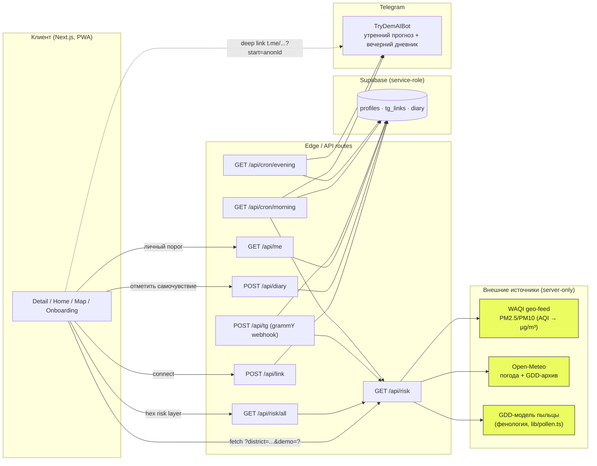

# DemAI — персональный прогноз риска

**DemAI** («дем» — каз. *дыхание*) — это мобильный PWA для Алматы, который
превращает воздух, пыльцу и погоду в **одно число риска от 1 до 10** и три
человеческих напоминания на завтра. Без регистрации и без логина: за пять тапов
онбординг строит анонимный профиль (диагноз, триггеры, район), считает риск по
объяснимой формуле TVEP и показывает его на единственном скроллящемся экране —
тот же экран служит и результатом, и демо-стендом. Утренний прогноз и вечерний
вопрос «как ты сегодня?» уходят в Telegram; ответы замыкают петлю
самообучения — через 7 дней дневника DemAI находит личный порог PM2.5 и
пересчитывает риск под конкретного человека, а не под общую шкалу.

> Дизайн-система — [`DESIGN.md`](../DESIGN.md) (эталон — концепт Airly, 1:1 по
> визуалу, отклонения зафиксированы в шапке файла). Промпт-пайплайн —
> [`PROMPTS.md`](../PROMPTS.md).

---

## Стек

- **Next.js 16** (App Router, TypeScript, strict) — UI, API routes, PWA-манифест.
- **Tailwind CSS v4** + дизайн-токены из `DESIGN.md` (4 базовых цвета + производные).
- **lucide-react** — иконки; **Onest** (Google Fonts) — единственный шрифт (кириллица + казахские глифы).
- **MapLibre GL** + **h3-js** — карта риска (H3-гекс-слой вместо точек).
- **grammY** — Telegram-бот (вебхук + long-polling для локальной разработки).
- **Supabase** (service-role, только на сервере) — `profiles`, `tg_links`, `diary`.
- **Витест** — юнит-тесты движка; **Playwright** — один happy-path e2e.
- Деплой — **Vercel** (crons в `vercel.json`).

---

## Архитектура



Один API-контракт на всё приложение: `GET /api/risk?district=<slug>&p=<base64 profile>`
компонует воздух (WAQI) + пыльцу (GDD-модель) + погоду (Open-Meteo) →
`computeRisk` сейчас + почасовой прогноз на 14 часов, вердикт, разбивку
`{pm, pollen, wx}` в процентах (кормит WhyCard), `pm25`, `pollen`, `sparse`.
Ответ кешируется 10 минут на `(district, profile)`. Демо-режим (`?demo=1` или
`DEMO=1`) отдаёт зафиксированный снимок `data/demo_snapshot.json` без сети —
стенд не зависит от Wi-Fi площадки.

---

## Запуск за 3 команды

```bash
npm install
cp ../.env.local .env.local      # токены (см. таблицу ниже)
npm run dev                      # http://localhost:3000  →  /d/bostandyk?demo=1
```

Демо-режим работает офлайн из коробки (снимок уже в репозитории). Для живых
данных нужны `WAQI_TOKEN` и сеть; для бота и дневника — Supabase + токены TG.

Полезные скрипты:

```bash
npm run build          # production-сборка (должна пройти с 0 type errors)
npm run lint:design    # дизайн-гарды (hex / legacy-name / radius / i18n) — должен быть зелёным
npm run icons          # перегенерить PWA-иконки в /public
npm run test           # витест-юниты движка риска/пыльцы/порога
npm run e2e            # Playwright happy-path в демо-режиме
npm run snapshot       # записать свежий data/demo_snapshot.json (онлайн)
npm run tg:dev         # long-polling бот для локальной отладки без публичного URL
npm run seed:diary -- <anonId>   # 8 синтетических строк дневника (см. disclosure)
```

---

## Переменные окружения

| Переменная | Где | Назначение | Обязательно |
|---|---|---|---|
| `WAQI_TOKEN` | server | Токен WAQI geo-feed (PM2.5/PM10). | живые данные |
| `SUPABASE_URL` | server | URL проекта Supabase. | бот + дневник |
| `SUPABASE_SERVICE_ROLE` | server | Service-role ключ (только сервер). | бот + дневник |
| `NEXT_PUBLIC_TG_BOT` | client | Username бота для deep link `t.me/<bot>?start=<anonId>`. | бот |
| `TG_BOT_TOKEN` | server | Токен grammY-бота. | бот |
| `TG_WEBHOOK_SECRET` | server | `x-telegram-bot-api-secret-token` для `/api/tg`. | прод-бот |
| `CRON_SECRET` | server | `Authorization: Bearer` для cron-роутов. | cron |
| `DEMO` | server | `=1` форсирует демо-режим (снимок, без сети). | нет |

---

## Деплой (Vercel + crons)

1. Импорт репозитория в Vercel, root-директория — `demai/`.
2. Прописать переменные из таблицы выше в Project → Settings → Environment Variables.
3. Создать таблицы: выполнить [`supabase/schema.sql`](supabase/schema.sql) в Supabase SQL editor.
4. Поставить вебхук бота: `https://api.telegram.org/bot<TG_BOT_TOKEN>/setWebhook?url=https://<домен>/api/tg&secret_token=<TG_WEBHOOK_SECRET>`.
5. Cron заданы в [`vercel.json`](vercel.json):
   - `30 2 * * *` UTC (`07:30` Алматы) → `/api/cron/morning` — утренний прогноз.
   - `0 15 * * *` UTC (`20:00` Алматы) → `/api/cron/evening` — вопрос дневника.
   Оба роута требуют заголовок `Authorization: Bearer ${CRON_SECRET}`.

---

## Data disclosure (честно, по правилам хакатона)

Демо-режим и калибровки — не настоящие данные. Все «синтетические» значения и
не подтверждённые константы помечены в коде `// SYNTHETIC` / `// CALIBRATE`
соответственно; полный список ниже.

### Синтетические снимки и сиды (`// SYNTHETIC`)

| Где | Что | Как убрать |
|---|---|---|
| `data/demo_snapshot.json` | Зафиксированный ответ `/api/risk` по 8 районам Алматы (риск, вердикт, разбивка, pm25, пыльца, погода, 14-часовой прогноз). Используется в `?demo=1`, чтобы стенд не зависел от Wi-Fi. Сгенерирован `npm run snapshot` с нейтральным профилем. | не коммитить свежий; удалить файл → live-режим. |
| `data/demo_pollen.json` | Зафиксированные уровни пыльцы для демо-режима (читается `lib/pollen.ts` при `isDemo()`). | удалить файл. |
| `scripts/seed-diary.ts` | Вставляет **8 синтетических строк дневника** для теста петли самообучения. Каждая строка и лог помечены `SYNTHETIC SEED`. | `delete from diary where anon_id='<anonId>';` |

### Калибровочные константы (`// CALIBRATE`)

| Где | Константа | Значение | Статус |
|---|---|---|---|
| `lib/pollen.ts` `DEFAULT_SPECIES.birch` | `startGdd / peakGdd / endGdd` | 90 / 170 / 300 (base 5 °C) | placeholder из общей фенологической литературы — **verify before finals**. |
| `lib/pollen.ts` `DEFAULT_SPECIES.wormwood` | `startGdd / peakGdd / endGdd` | 480 / 700 / 950 | то же. |
| `lib/pollen.ts` `DEFAULT_SPECIES.ragweed` | `startGdd / peakGdd / endGdd` | 620 / 850 / 1100 | то же. |
| `data/pollen_overrides.json` | Almaty-калибровка (wormwood 1100/1900/2600, ragweed 1500/2200/2900) | против климата Алматы (~1622 GDD к середине июля по архиву Open-Meteo) | калибровано под Алматы, но **verify before finals**. |
| `lib/risk.ts` `PM_BANDS` | Точки перелома PM2.5 → 0..1 | 12/35/55/150 µg/m³ → 0.15/0.45/0.7/0.95 | EPA-style breakpoints, публичная методология. |
| `lib/risk.ts` веса | `wPm / wPollen / wWx` | 0.5 / 0.35 / 0.15 (без пыльцы → 0.85/0/0.15) | дизайнерское решение, не эмпирика. |
| `lib/risk.ts` `multiplier` | Чувствительность по диагнозу | MAX по выбранным условиям из `lib/conditions.ts` (asthma 1.15, copd 1.25, other_unknown/sensitive_group 1.2, pollinosis 1.0, иначе 1.0) | дизайнерское решение. |
| `lib/threshold.ts` | Личный порог PM2.5 | медиана pm25 по строкам `feeling=3`, ≥3 таких и ≥7 всего, кламп [20, 80] | эвристика, требует валидации клиницистом. |

Каждое число в UI имеет источник данных; плейсхолдеры помечены `// SYNTHETIC` в
коде (правило `DESIGN.md §8`).

---

## Структура

```
demai/
├─ app/            # Next.js App Router: /d/[district], /home, /map, /onboarding, /api/*
├─ components/ui/  # чистый presentational-кит (TopBar, AccentBlock, MetricCard, ForecastBars …)
├─ lib/            # риск-движок, GDD-пыльца, воздух, погода, i18n, compose, supabase, grammY
├─ data/           # районы, geojson, демо-снимки, pollen overrides
├─ scripts/        # make-snapshot, gen-icons, pollen-print, seed-diary, tg-dev, lint-design
├─ e2e/            # Playwright happy-path
├─ supabase/schema.sql
└─ public/         # PWA-иконки (генерируются `npm run icons`)
```
